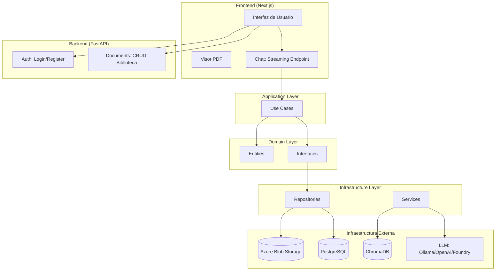
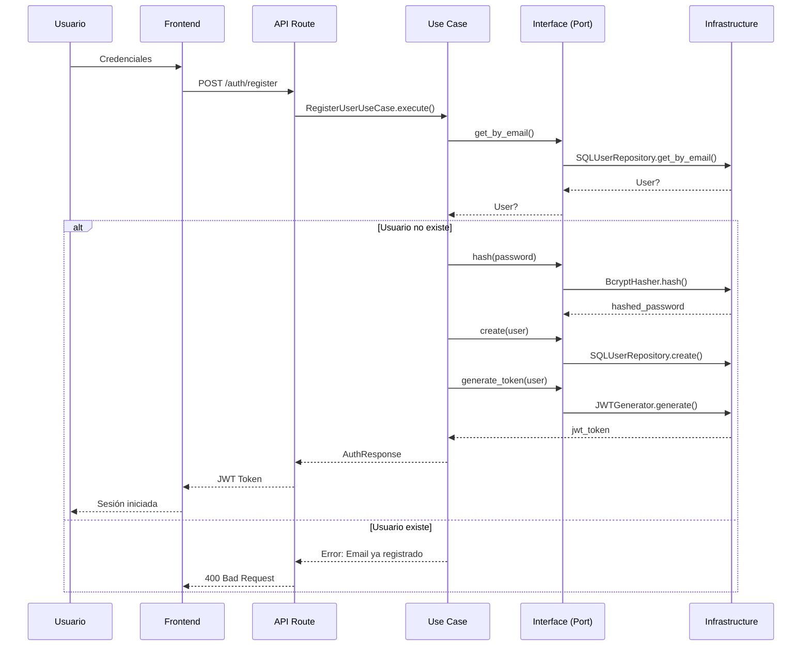
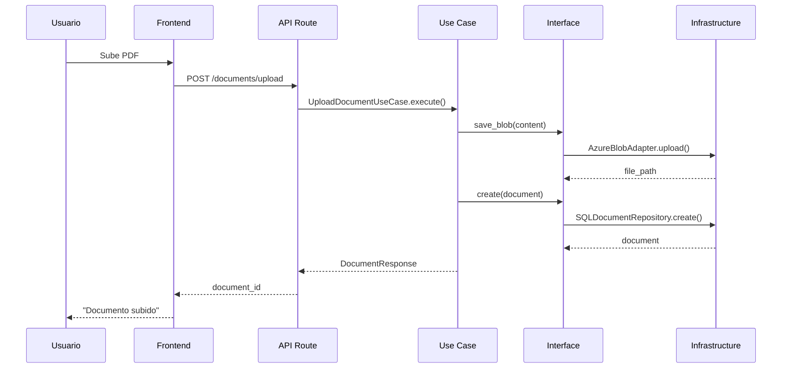

# Arquitectura - mh-agent

**Enfoque**: Clean Architecture + Domain-Driven Design

---

## 1. Visión General

### 1.1 Propósito

Arquitectura basada en Clean Architecture para un sistema de tutoría socrática con IA. El sistema permite a los usuarios subir documentos PDF y interactuar con ellos mediante un agente inteligente.

### 1.2 Principios Fundamentales

| Principio                           | Descripción                                |
| ----------------------------------- | ------------------------------------------ |
| **Domain Puro**                     | Entidades sin dependencias externas        |
| **Use Cases**                       | Orquestan la lógica de negocio             |
| **Inversión de Dependencias**       | Las dependencias apuntan hacia el interior |
| **Separación de Responsabilidades** | Cada capa tiene una responsabilidad única  |
| **Testabilidad**                    | Cada capa puede probarse en aislamiento    |

---

## 2. Arquitectura del Sistema

### 2.1 Capas de Clean Architecture

```
┌─────────────────────────────────────────────────────────────┐
│                    Presentation Layer                       │
│              (API Routes, Controllers, DTOs)                │
├─────────────────────────────────────────────────────────────┤
│                    Application Layer                        │
│                    (Use Cases / Services)                   │
├─────────────────────────────────────────────────────────────┤
│                      Domain Layer                           │
│            (Entities, Value Objects, Interfaces)            │
├─────────────────────────────────────────────────────────────┤
│                   Infrastructure Layer                      │
│        (Repositories, External Services, Frameworks)       │
└─────────────────────────────────────────────────────────────┘
```

### 2.2 Diagrama de Componentes



---

## 3. Responsabilidades por Capa

### 3.1 Domain Layer (Capa de Dominio)

**Responsabilidad**: Reglas de negocio puras, sin dependencias externas.

| Componente        | Descripción                                                            |
| ----------------- | ---------------------------------------------------------------------- |
| **Entities**      | User, Document, Conversation                                           |
| **Value Objects** | Email, Password (inmutables)                                           |
| **Interfaces**    | IUserRepository, IDocumentRepository, IPasswordHasher, ITokenGenerator |

**Reglas**:

- Sin imports de frameworks (no pydantic, no jwt, no sqlalchemy)
- Solo lógica de negocio
- Métodos que representan reglas del dominio

### 3.2 Application Layer (Capa de Aplicación)

**Responsabilidad**: Orquestar casos de uso, coordinar entidades y servicios.

| Componente    | Descripción                                            |
| ------------- | ------------------------------------------------------ |
| **Use Cases** | RegisterUser, LoginUser, UploadDocument, ListDocuments |
| **DTOs**      | Objetos para transferencia entre capas                 |

**Reglas**:

- Inyecta dependencias (repositories, services)
- No contiene lógica de negocio directa
- Coordina flujo de datos

### 3.3 Infrastructure Layer (Capa de Infraestructura)

**Responsabilidad**: Implementaciones concretas de los puertos.

| Componente       | Descripción                              |
| ---------------- | ---------------------------------------- |
| **Repositories** | SQLUserRepository, SQLDocumentRepository |
| **Services**     | BcryptHasher, JWTGenerator               |
| **Storage**      | AzureBlobAdapter                         |

**Reglas**:

- Implementa interfaces definidas en domain
- Maneja dependencias externas (DB, Storage, AI)
- Framework-specific

### 3.4 Presentation Layer (Capa de Presentación)

**Responsabilidad**: Exponer la API al exterior.

| Componente       | Descripción                        |
| ---------------- | ---------------------------------- |
| **Routes**       | FastAPI endpoints                  |
| **Schemas**      | Pydantic models (request/response) |
| **Dependencies** | FastAPI dependency injection       |

---

## 4. Estructura del Proyecto

### 4.1 Organización de Código

```
src/
├── config/                      # Configuración global
│   ├── __init__.py
│   ├── settings.py             # Configuraciones (JWT, DB, Blob, AI)
│   └── dependencies.py         # Proveedores de dependencias FastAPI
│
├── domain/                      # DOMINIO (puro, sin dependencias externas)
│   ├── __init__.py
│   ├── entities/               # Entidades del negocio
│   │   ├── __init__.py
│   │   ├── user.py            # User entity
│   │   ├── document.py        # Document entity
│   │   └── conversation.py     # Conversation entity
│   │
│   ├── value_objects/          # Objetos valor (inmutables)
│   │   ├── __init__.py
│   │   ├── email.py           # Email validado
│   │   └── password.py        # Password (sin hashing)
│   │
│   └── interfaces/             # PUERTOS (contratos)
│       ├── __init__.py
│       ├── user_repository.py     # IUserRepository
│       ├── document_repository.py # IDocumentRepository
│       ├── password_hasher.py     # IPasswordHasher
│       ├── token_generator.py     # ITokenGenerator
│       └── blob_storage.py        # IBlobStorage
│
├── application/                # APPLICATION LAYER
│   ├── __init__.py
│   │
│   └── use_cases/             # Casos de uso
│       ├── __init__.py
│       │
│       ├── auth/              # Autenticación
│       │   ├── __init__.py
│       │   ├── register_user.py
│       │   ├── login_user.py
│       │   └── dto.py         # Data Transfer Objects
│       │
│       └── documents/         # Gestión documental
│           ├── __init__.py
│           ├── upload_document.py
│           ├── list_documents.py
│           └── get_document.py
│
├── infrastructure/             # INFRASTRUCTURE (adaptadores)
│   ├── __init__.py
│   │
│   ├── database/              # Configuración DB
│   │   ├── __init__.py
│   │   ├── connection.py      # SQLAlchemy engine/session
│   │   ├── models.py          # ORM Models
│   │   └── mappers.py         # Entity <-> Model mappers
│   │
│   ├── repositories/          # Implementación de repositorios
│   │   ├── __init__.py
│   │   ├── sql_user_repository.py
│   │   └── sql_document_repository.py
│   │
│   ├── services/              # Servicios externos
│   │   ├── __init__.py
│   │   ├── bcrypt_hasher.py   # Implementación IPasswordHasher
│   │   └── jwt_generator.py   # Implementación ITokenGenerator
│   │
│   └── storage/               # Storage adapters
│       ├── __init__.py
│       └── azure_blob_adapter.py
│
├── api/                       # PRESENTATION LAYER
│   ├── __init__.py
│   │
│   ├── routes/               # FastAPI routes
│   │   ├── __init__.py
│   │   ├── auth.py
│   │   ├── documents.py
│   │   └── health.py
│   │
│   ├── schemas/              # Pydantic schemas (request/response)
│   │   ├── __init__.py
│   │   ├── auth.py
│   │   └── documents.py
│   │
│   └── dependencies.py       # FastAPI dependencies
│
├── agents/                    # Agentes AI (integración con MAF)
│   ├── __init__.py
│   ├── base_agent.py
│   ├── providers/
│   │   ├── __init__.py
│   │   ├── openai_provider.py
│   │   ├── ollama_provider.py
│   │   └── ai_project_provider.py
│   └── tools/
│       ├── __init__.py
│       ├── document_processor.py
│       └── semantic_search.py
│
└── main.py                    # Entry point
```

---

## 5. Flujos de Datos

### 5.1 Autenticación



### 5.2 Gestión de Documentos



---

## 6. API Reference

### 6.1 Autenticación

| Método | Endpoint         | Descripción   | Uso Case     |
| ------ | ---------------- | ------------- | ------------ |
| POST   | `/auth/register` | Crear usuario | RegisterUser |
| POST   | `/auth/login`    | Login → JWT   | LoginUser    |

### 6.2 Documentos

| Método | Endpoint            | Descripción         | Uso Case       |
| ------ | ------------------- | ------------------- | -------------- |
| POST   | `/documents/upload` | Subir PDF           | UploadDocument |
| GET    | `/documents/`       | Listar biblioteca   | ListDocuments  |
| GET    | `/documents/{id}`   | Ver detalle         | GetDocument    |
| PATCH  | `/documents/{id}`   | Actualizar metadata | UpdateDocument |
| DELETE | `/documents/{id}`   | Eliminar            | DeleteDocument |

### 6.3 Chat

| Método | Endpoint | Descripción                      | Uso Case       |
| ------ | -------- | -------------------------------- | -------------- |
| POST   | `/chat`  | Streaming de respuesta socrática | ProcessMessage |

---

## 7. Seguridad

- **JWT Tokens**: Autenticación stateless con expiración configurable
- **Password Hashing**: Bcrypt con salt
- **Scoped Access**: Usuarios solo ven sus documentos
- **Rol Admin**: Gestión de usuarios

---

## 8. Glosario

| Término          | Definición                               |
| ---------------- | ---------------------------------------- |
| **Domain**       | Reglas de negocio puro, sin dependencias |
| **Use Case**     | Orquestador de lógica de aplicación      |
| **Port**         | Interfaz abstracta en domain             |
| **Adapter**      | Implementación concreta de un port       |
| **Entity**       | Objeto con identidad única               |
| **Value Object** | Obmutable definido por atributos         |
| **DTO**          | Data Transfer Object                     |

---

## 9. Referencias

- [Clean Architecture - Robert C. Martin](https://blog.cleancoder.com/uncle-bob/2012/08/13/the-clean-architecture.html)
- [Domain-Driven Design - Eric Evans](https://domainlanguage.com/ddd/)
- [Hexagonal Architecture - Alistair Cockburn](https://alistair.cockburn.us/hexagonal-architecture/)
