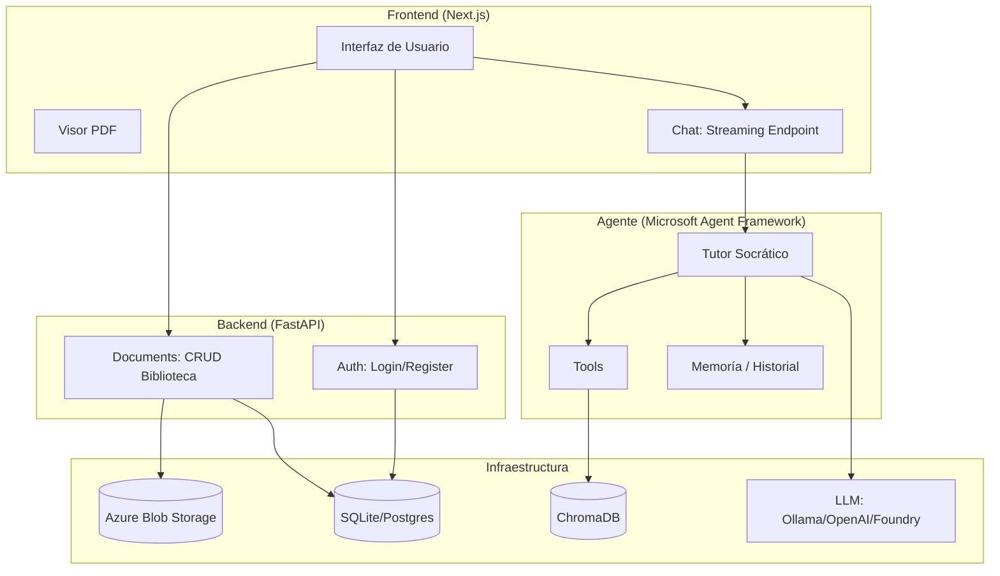
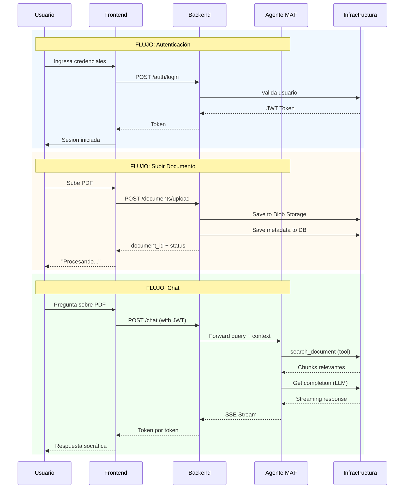

# Arquitectura - Noetix AI

**Versión**: 1.0  
**Enfoque**: MVP funcional con Microsoft Agent Framework

---

## 1. Visión General

### 1.1 Propósito

Esta arquitectura define cómo el usuario interactúa con documentos PDF mediante un tutor socrático impulsado por IA. El sistema sigue el principio KISS: simplicidad sin sacrificar funcionalidad.

### 1.2 Principios Fundamentales

| Principio              | Descripción                                   |
| ---------------------- | --------------------------------------------- |
| **Backend Mínimo**     | Solo CRUD de usuarios y documentos            |
| **Agente Inteligente** | MAF maneja RAG, memoria y contexto            |
| **Separación Clara**   | Backend ≠ Agente ≠ Infraestructura            |
| **Escalabilidad**      | De local (ChromaDB) a cloud (Azure AI Search) |

---

## 2. Arquitectura del Sistema

### 2.1 Diagrama de Componentes



### 2.2 Flujo de Datos



---

## 3. Responsabilidades por Capa

### 3.1 Backend (FastAPI)

| Recurso       | Endpoints                                 | Responsabilidad                 |
| ------------- | ----------------------------------------- | ------------------------------- |
| **Auth**      | `POST /auth/register`, `POST /auth/login` | Gestión de usuarios y JWT       |
| **Documents** | CRUD completo                             | Biblioteca personal del usuario |
| **Chat**      | `POST /chat`                              | Gateway al agente con streaming |

**Importante**: El backend NO procesa documentos ni consulta ChromaDB. Esa responsabilidad es del agente.

### 3.2 Agente (Microsoft Agent Framework)

| Componente          | Responsabilidad                        |
| ------------------- | -------------------------------------- |
| **Tutor Socrático** | Genera respuestas con preguntas guía   |
| **Tools**           | Pipeline RAG, búsqueda en ChromaDB     |
| **Memoria**         | Historial de conversaciones y sesiones |

El agente accede a ChromaDB **directamente** mediante tools, no a través del backend.

### 3.3 Infraestructura

| Servicio            | Uso                                              |
| ------------------- | ------------------------------------------------ |
| **Blob Storage**    | Almacenamiento de PDFs                           |
| **SQLite/Postgres** | Metadatos de usuarios y documentos               |
| **ChromaDB**        | Vector store para RAG                            |
| **LLM**             | Generación de respuestas (Ollama/OpenAI/Foundry) |

---

## 4. Estructura de Proyecto

### 4.1 Organización de Código (Estado Actual)

```yml
src/
├── config/
│   └── settings.py            # ✅ Implementado
│
├── domain/
│   └── entities/             # ✅ Implementado
│       ├── user.py
│       ├── document.py
│       └── conversation.py
│
├── infrastructure/
│   └── repositories/         # ✅ Implementado (blob + db)
│       └── document_repository_blob.py
│
├── agents/                   # Proveedores LLM existentes
│   ├── base_agent.py
│   ├── ollama_provider.py
│   ├── openai_provider.py
│   └── ai_project_provider.py
│
├── api/
│   ├── routes/
│   │   ├── documents.py     # ✅ Implementado (upload, list, get)
│   │   └── health.py
│   └── dependencies.py
│
└── main.py                   # ✅ Implementado
```

> **Nota**: La estructura se simplifica para el MVP. Los servicios de dominio y repositorios separados se implementarán según necesidad.

### 4.2 Frontend (Next.js)

```yml
frontend/
├── app/
│   ├── auth/              # Login/Register
│   ├── dashboard/         # Biblioteca de documentos
│   └── reader/           # Visor PDF + Chat
│
└── components/
    ├── pdf-viewer/       # Visor PDF
    └── chat/             # Interfaz de chat
```

---

## 5. Casos de Uso

### 5.1 Autenticación

```bash
Usuario → Register → Backend → DB
Usuario → Login → Backend → JWT → Frontend
```

### 5.2 Gestión de Biblioteca

| Acción          | Flujo                                     |
| --------------- | ----------------------------------------- |
| **Subir PDF**   | Frontend → Backend → Blob + DB            |
| **Listar**      | Frontend → Backend → DB                   |
| **Ver detalle** | Frontend → Backend → DB → URL temporal    |
| **Eliminar**    | Frontend → Backend → Blob + DB + ChromaDB |
| **Actualizar**  | Frontend → Backend → DB                   |

### 5.3 Tutoría con IA

```md
1. Usuario envía pregunta
2. Backend reenvía al agente (con JWT)
3. Agente busca contexto en ChromaDB (tool)
4. Agente genera respuesta socrática
5. LLM responde con streaming
6. Backend → Frontend (SSE)
```

---

## 6. Herramientas del Agente

### 6.1 Tools Definidas

| Tool               | Función                                                 |
| ------------------ | ------------------------------------------------------- |
| `process_document` | Pipeline RAG: docling → chunking → embedding → ChromaDB |
| `search_document`  | Búsqueda semántica en ChromaDB                          |
| `get_document`     | Obtiene metadatos del documento                         |

### 6.2 Memoria

El agente maneja:

- **Historial de conversación**: Accumula contexto
- **Sesiones**: Mantiene estado entre requests
- **Almacenamiento**: ChromaDB o Redis

---

## 7. Decisiones Arquitectónicas

### 7.1 Por qué Backend Mínimo?

1. **MAF ya tiene lo necesario**: Tool calling, memoria, streaming
2. **Separación de responsabilidades**: Backend = datos, Agente = inteligencia
3. **Mantenibilidad**: Código simple de mantener

### 7.2 Por qué ChromaDB Local?

- **Desarrollo sin infraestructura cloud**
- **Configuración mínima**
- **Compatible con MAF**

> **Post-MVP**: Migrar a Azure AI Search

### 7.3 Por qué Pipeline como Tool?

- **Flexibilidad**: El agente decide cuándo procesar
- **Reusabilidad**: Puedo invocar desde chat o manualmente
- **Simplicidad**: No necesita webhook externo (Azure Function)

---

## 8. API Reference

### 8.1 Autenticación

| Método | Endpoint         | Descripción   |
| ------ | ---------------- | ------------- |
| POST   | `/auth/register` | Crear usuario |
| POST   | `/auth/login`    | Login → JWT   |

### 8.2 Documentos

| Método | Endpoint            | Descripción         |
| ------ | ------------------- | ------------------- |
| POST   | `/documents/upload` | Subir PDF           |
| GET    | `/documents/`       | Listar biblioteca   |
| GET    | `/documents/{id}`   | Ver detalle         |
| PATCH  | `/documents/{id}`   | Actualizar metadata |
| DELETE | `/documents/{id}`   | Eliminar            |

### 8.3 Chat

| Método | Endpoint | Descripción                      |
| ------ | -------- | -------------------------------- |
| POST   | `/chat`  | Streaming de respuesta socrática |

---

## 9. Seguridad

- **JWT Tokens**: Autenticación stateless
- **Rol admin**: Gestión de usuarios
- **Scoped access**: Usuario solo ve sus documentos

---

## 10. Roadmap

### MVP (Estado Actual)

| Componente | Estado | Notas |
|------------|--------|-------|
| Estructura de directorios | ✅ Completo | |
| Settings | ✅ Completo | `src/config/settings.py` |
| Entities | ✅ Completo | User, Document, Conversation |
| Upload PDF | ✅ Completo | `POST /documents/upload` |
| List Documents | ✅ Completo | `GET /documents/` |
| Get Document | ✅ Completo | `GET /documents/{id}` |
| Auth: Login/Register | ❌ Pendiente | |
| Delete Document | ❌ Pendiente | |
| Update Document | ❌ Pendiente | |
| Chat endpoint | ❌ Pendiente | Gateway al agente MAF |
| Tools: process_document | ❌ Pendiente | Pipeline RAG |
| Integración ChromaDB | ❌ Pendiente | |

### Post-MVP

- [ ] Azure AI Search (reemplazo de ChromaDB)
- [ ] Azure Functions para procesamiento automático
- [ ] Mejora de prompts socráticos
- [ ] Resaltado coordinada PDF-Chat

---

## 11. Glosario

| Término       | Definición                               |
| ------------- | ---------------------------------------- |
| **MAF**       | Microsoft Agent Framework                |
| **RAG**       | Retrieval-Augmented Generation           |
| **Tool**      | Función que el agente puede invocar      |
| **Streaming** | Respuesta token por token en tiempo real |
| **SSE**       | Server-Sent Events                       |

---
