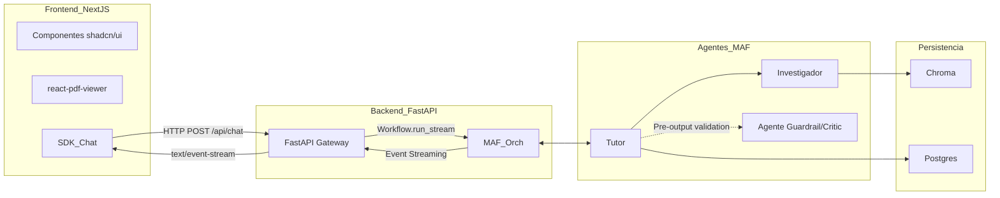
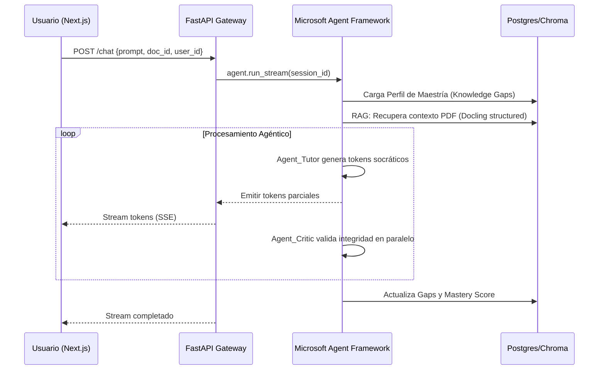

# Software Design Document (SDD)

## Proyecto: Ecosistema de Lectura Agéntica (MVP)

**Enfoque Técnico:** Orquestación Asíncrona con Streaming de Tokens

**Framework de Backend:** Microsoft Agent Framework (MAF) con Python

**Framework de Frontend:** Next.js con Vercel AI SDK (Consumo de Stream)

---

## 1. Arquitectura del Sistema (Diagrama General)

El sistema utiliza un modelo de **Solicitud-Respuesta con Streaming**. El backend no mantiene una conexión bidireccional constante, sino que procesa la lógica de los agentes y emite un flujo continuo de eventos hacia el cliente.



---

## 2. Flujo de Datos y Streaming (Secuencia)

En lugar de WebSockets, aprovechamos el método `run_stream()` de MAF que emite `AgentRunUpdateEvent`. El backend encapsula esto en una `StreamingResponse` de FastAPI.



---

## 3. Especificación de Componentes del Backend

### 3.1. Ingesta Estructural (Docling Service)

No se almacena texto plano. Docling descompone el PDF en un `DoclingDocument` con:

* **Jerarquía:** Títulos, subtítulos y párrafos relacionados.

* **Multimodalidad:** Extracción de tablas en Markdown y bboxes de imágenes.
* **Metadatos de Posición:** Cada chunk guarda `page_index` y `coordinates` (JSON) para la sincronización visual.

### 3.2. Orquestación de Agentes (MAF Workflows)

Utilizaremos el patrón **Sequential Orchestration** con un nodo crítico:

1. **Node_Context:** Inyecta el `StudentMasteryState` desde Postgres.
2. **Node_Tutor:** Genera la respuesta. Su `System Instruction` prohíbe respuestas directas.
3. **Node_Stream_Wrapper:** Captura los tokens y los emite al `WorkflowContext` usando `yield_output`.

---

## 4. Gestión de Memoria y Estado (Mastery State)

Para el MVP, la memoria persistente se maneja mediante un `HistoryProvider` personalizado en MAF que lee y escribe en PostgreSQL.

**Esquema del Objeto de Estado (JSONB):**

```json
{
  "user_id": "uuid",
  "document_context": {
    "doc_id": "pdf_hash",
    "pages_visited": [6, 7, 8],
    "last_socratic_score": 0.82
  },
  "mastery_graph": {
    "detected_gaps":,
    "verified_concepts":
  }
}

```

---

## 5. Arquitectura del Frontend (MVP)

### 5.1. Sincronización Visor-Chat

* **Deep Linking:** Cuando el agente menciona un concepto, el JSON de respuesta incluye un campo `citation_coords`.

* **Visor de PDF:** Implementación de `@react-pdf-viewer` configurada con `Trigger.None` para renderizar resaltados programáticos sobre el PDF basados en las coordenadas recibidas del backend.

### 5.2. Consumo de Stream

Utilizaremos el **Vercel AI SDK** en el lado del cliente únicamente como gestor de estado de la interfaz:

* `useChat`: Hook para manejar el historial de mensajes local y parsear el flujo de tokens que llega de la ruta de FastAPI.
* **Alternativa nativa:** Si decides no usar Vercel SDK, se implementará un `ReadableStream` manual con la API `fetch`.

---

## 6. Infraestructura de Evaluación (Evals)

| Componente | Métrica Técnico-Pedagógica | Herramienta |
| --- | --- | --- |
| **RAG** | Context Precision / Faithfulness | Ragassessment (Evaluación de recuperación de contexto) |
| **Tutor** | Socratic Scaffolding Index (0-1) | LLM-as-a-Judge (Rubric-based) |
| **Backend** | Time to First Token (TTFT) < 1s | OpenTelemetry / MAF Events |
