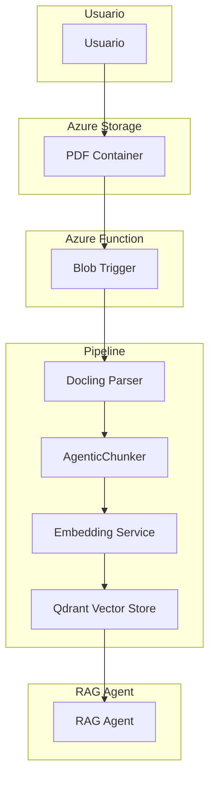
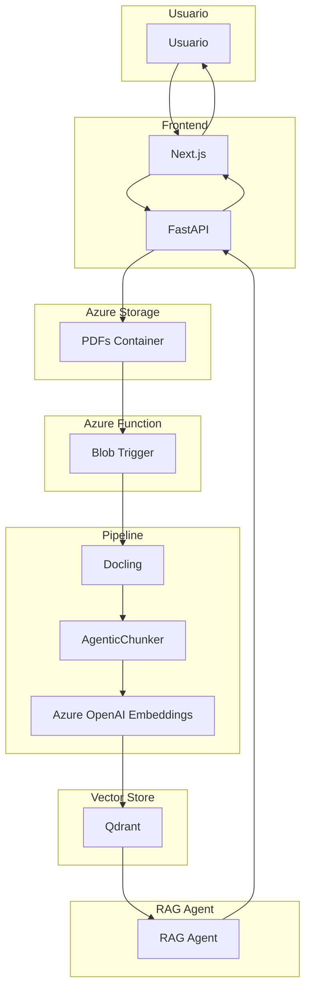

# Arquitectura - RAG Preprocessing Pipeline

---

## 1. Visión General

### 1.1 Propósito

Pipeline automatizado para indexar documentos PDF en Qdrant vector store. Se ejecuta cuando el usuario sube un archivo al Blob Storage.

### 1.2 Flujo Completo



---

## 2. Componentes del Pipeline

### 2.1 Document Processor (Docling)

```python
from src.rag.pipeline.document_processor import DocumentProcessor

processor = DocumentProcessor()
markdown = processor.process_pdf_from_azure("documento.pdf")
```

### 2.2 Agentic Chunker (Microsoft Agent Framework)

```python
from src.rag.pipeline.chunker import AgenticChunker

chunker = AgenticChunker()
chunks = chunker.chunk_sync(markdown_text)
```

**Características**:

- Usa AzureOpenAIChatClient de Microsoft Agent Framework
- Preserva ecuaciones (LaTeX), tablas, código, markdown
- Salida JSON con metadatos de sección

### 2.3 Embedding Service (Azure OpenAI)

```python
from src.rag.pipeline.embedding import EmbeddingService

embedding_service = EmbeddingService()
embeddings = embedding_service.embed(["texto1", "texto2"])
```

**Nota**: Usa OpenAI SDK directamente (no chromadb) para evitar duplicación del path `/embeddings`.

### 2.4 Vector Store (Qdrant)

```python
from src.rag.pipeline.vector_store import VectorStore

vector_store = VectorStore()
vector_store.vectorize_and_store_chunks(chunks)
results = vector_store.search("query", limit=5)
```

---

## 3. Pipeline Completo

```python
from src.rag.pipeline import process_document_from_blob

# Procesa documento y almacena en Qdrant
chunks_count = process_document_from_blob("documento.pdf")
print(f"Indexados {chunks_count} chunks")
```

---

## 4. Azure Function

```python
# src/rag/function/function_app.py
import azure.functions as func
from src.rag.pipeline import process_document_from_blob

app = func.FunctionApp()

@app.blob_trigger(
    path="pdfs/{name}",
    connection="AzureWebJobsStorage"
)
def process_document(name: str, context: func.Context):
    """Triggered when new PDF is uploaded."""
    count = process_document_from_blob(name)
    return func.HttpResponse(f"Indexed {count} chunks", status_code=200)
```

---

## 5. Configuración

### Environment Variables (.env)

```bash
# Azure OpenAI
AZURE_OPENAI_ENDPOINT=https://xxx.openai.azure.com/
AZURE_OPENAI_API_KEY=xxx
AZURE_OPENAI_MODEL_ID=gpt-4o

# Embeddings
LLM_EMBEDDING_ENDPOINT=https://xxx.openai.azure.com/
LLM_EMBEDDING_MODEL=text-embedding-3-large
LLM_EMBEDDING_APIKEY=xxx
LLM_EMBEDDING_API_VERSION=2024-02-01

# Qdrant
QDRANT_URL=http://localhost:6333
QDRANT_API_KEY=xxx
```

### Settings Centralizados

Located at `src/config/settings.py`:

| Setting          | Default | Descripción                           |
| ---------------- | ------- | ------------------------------------- |
| `VECTOR_SIZE`    | 3072    | Dimensiones de text-embedding-3-large |
| `MAX_CHUNK_SIZE` | 800     | Tokens máximos por chunk              |
| `MIN_CHUNK_SIZE` | 200     | Tokens mínimos por chunk              |
| `CHUNK_LIMIT`    | 5       | Límite de resultados en search        |

---

## 6. Diagrama del Sistema



---

## 7. Glosario

| Término              | Definición                                        |
| -------------------- | ------------------------------------------------- |
| **Docling**          | Framework de parsing de documentos PDF            |
| **AgenticChunker**   | Chunking con Microsoft Agent Framework            |
| **EmbeddingService** | Generación de embeddings con OpenAI SDK           |
| **Qdrant**           | Vector database para almacenamiento de embeddings |
| **Blob Trigger**     | Azure Function que se ejecuta al subir archivo    |

---

## 8. Referencias

- [Docling](https://ds4sd.github.io/docling/)
- [Microsoft Agent Framework](https://learn.microsoft.com/azure/ai-foundry/)
- [Qdrant](https://qdrant.tech/documentation/)
- [Azure OpenAI Embeddings](https://learn.microsoft.com/azure/ai-services/openai/how-to/embeddings)
